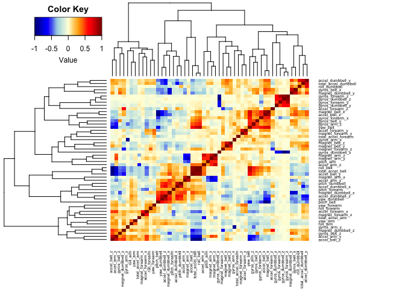
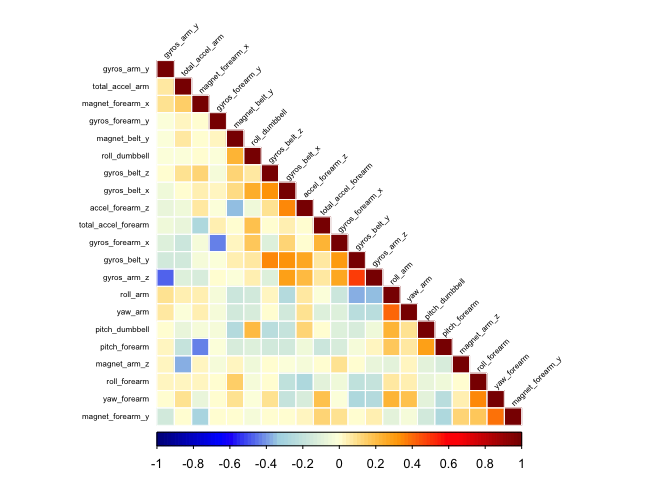
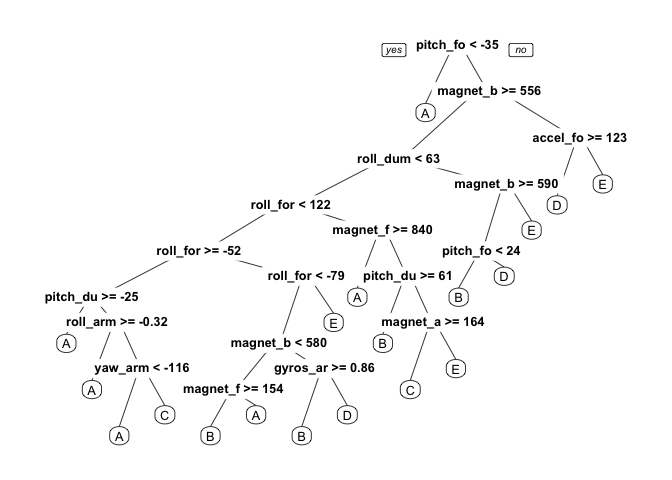

# Analysis of Weight Lifting Exercises Dataset
VeryFatBoy  

## Executive summary

In this project, we use data from accelerometers on the belt, forearm, arm, and dumbbell of six participants. These participants were asked to perform barbell lifts correctly and incorrectly in five different ways, as follows [1]:

* Class A: exactly according to the specification
* Class B: throwing the elbows to the front
* Class C: lifting the dumbbell only halfway
* Class D: lowering the dumbbell only halfway
* Class E: throwing the hips to the front

Class A represented the correct execution of the exercise. The other four represented common mistakes. The goal was to quantify how well the participants did the barbell lifts. More information about the original experiments is available from [1].

The goal of our project is to predict the manner in which the participants did the exercise. This is the **classe** variable in the training set. We will use other variables to predict with. This report describes how the model was built, cross-validation, the out of sample error, and the reasons for particular choices. We will also use our prediction model to predict 20 different test cases.

## Loading and preprocessing the data

Let's begin by performing the prep work, such as loading libraries, loading data, and performing data transformation.


```r
# Load libraries
library(caret)
library(corrplot)
library(doParallel)
library(gplots)
library(randomForest)
library(rpart)
library(rpart.plot)
library(RColorBrewer)

# Set the seed
set.seed(1234)

# Set digits option
options(digits = 12)

na_values <- c("", "NA", "#DIV/0!")

# Download the training data set
file <- "https://d396qusza40orc.cloudfront.net/predmachlearn/pml-training.csv"
if (!file.exists("pml-training.csv"))
  download.file(file, destfile = "pml-training.csv", method = "curl")

# Load the training data set
pml_training_data <- read.csv("pml-training.csv",
                              header = TRUE,
                              sep = ",",
                              na.strings = na_values)

# Download the test data set
file <- "https://d396qusza40orc.cloudfront.net/predmachlearn/pml-testing.csv"
if (!file.exists("pml-testing.csv"))
  download.file(file, destfile = "pml-testing.csv", method = "curl")

# Load the test data set
pml_test_data <- read.csv("pml-testing.csv",
                          header = TRUE,
                          sep = ",",
                          na.strings = na_values)

# Check the data
dim(pml_training_data)
```

```
## [1] 19622   160
```

```r
dim(pml_test_data)
```

```
## [1]  20 160
```

Examining the data, there are many columns with missing values. So, we will remove these using **transpose**.


```r
# Ignore "", NA and #DIV/0! using transpose
pml_training_data <- pml_training_data[,complete.cases(t(pml_training_data))]
pml_test_data <- pml_test_data[,complete.cases(t(pml_test_data))]

# Check the data
dim(pml_training_data)
```

```
## [1] 19622    60
```

```r
dim(pml_test_data)
```

```
## [1] 20 60
```

This removes 100 columns. Now let's see the remaining columns.


```r
colnames(pml_training_data)
```

```
##  [1] "X"                    "user_name"            "raw_timestamp_part_1"
##  [4] "raw_timestamp_part_2" "cvtd_timestamp"       "new_window"          
##  [7] "num_window"           "roll_belt"            "pitch_belt"          
## [10] "yaw_belt"             "total_accel_belt"     "gyros_belt_x"        
## [13] "gyros_belt_y"         "gyros_belt_z"         "accel_belt_x"        
## [16] "accel_belt_y"         "accel_belt_z"         "magnet_belt_x"       
## [19] "magnet_belt_y"        "magnet_belt_z"        "roll_arm"            
## [22] "pitch_arm"            "yaw_arm"              "total_accel_arm"     
## [25] "gyros_arm_x"          "gyros_arm_y"          "gyros_arm_z"         
## [28] "accel_arm_x"          "accel_arm_y"          "accel_arm_z"         
## [31] "magnet_arm_x"         "magnet_arm_y"         "magnet_arm_z"        
## [34] "roll_dumbbell"        "pitch_dumbbell"       "yaw_dumbbell"        
## [37] "total_accel_dumbbell" "gyros_dumbbell_x"     "gyros_dumbbell_y"    
## [40] "gyros_dumbbell_z"     "accel_dumbbell_x"     "accel_dumbbell_y"    
## [43] "accel_dumbbell_z"     "magnet_dumbbell_x"    "magnet_dumbbell_y"   
## [46] "magnet_dumbbell_z"    "roll_forearm"         "pitch_forearm"       
## [49] "yaw_forearm"          "total_accel_forearm"  "gyros_forearm_x"     
## [52] "gyros_forearm_y"      "gyros_forearm_z"      "accel_forearm_x"     
## [55] "accel_forearm_y"      "accel_forearm_z"      "magnet_forearm_x"    
## [58] "magnet_forearm_y"     "magnet_forearm_z"     "classe"
```

```r
colnames(pml_test_data)
```

```
##  [1] "X"                    "user_name"            "raw_timestamp_part_1"
##  [4] "raw_timestamp_part_2" "cvtd_timestamp"       "new_window"          
##  [7] "num_window"           "roll_belt"            "pitch_belt"          
## [10] "yaw_belt"             "total_accel_belt"     "gyros_belt_x"        
## [13] "gyros_belt_y"         "gyros_belt_z"         "accel_belt_x"        
## [16] "accel_belt_y"         "accel_belt_z"         "magnet_belt_x"       
## [19] "magnet_belt_y"        "magnet_belt_z"        "roll_arm"            
## [22] "pitch_arm"            "yaw_arm"              "total_accel_arm"     
## [25] "gyros_arm_x"          "gyros_arm_y"          "gyros_arm_z"         
## [28] "accel_arm_x"          "accel_arm_y"          "accel_arm_z"         
## [31] "magnet_arm_x"         "magnet_arm_y"         "magnet_arm_z"        
## [34] "roll_dumbbell"        "pitch_dumbbell"       "yaw_dumbbell"        
## [37] "total_accel_dumbbell" "gyros_dumbbell_x"     "gyros_dumbbell_y"    
## [40] "gyros_dumbbell_z"     "accel_dumbbell_x"     "accel_dumbbell_y"    
## [43] "accel_dumbbell_z"     "magnet_dumbbell_x"    "magnet_dumbbell_y"   
## [46] "magnet_dumbbell_z"    "roll_forearm"         "pitch_forearm"       
## [49] "yaw_forearm"          "total_accel_forearm"  "gyros_forearm_x"     
## [52] "gyros_forearm_y"      "gyros_forearm_z"      "accel_forearm_x"     
## [55] "accel_forearm_y"      "accel_forearm_z"      "magnet_forearm_x"    
## [58] "magnet_forearm_y"     "magnet_forearm_z"     "problem_id"
```

Next, we will remove the following columns that are not important for Machine Learning:

* X (row number)
* user\_name
* raw\_timestamp\_part\_1
* raw\_timestamp\_part\_2
* cvtd\_timestamp
* new\_window
* num\_window
* problem\_id


```r
# Remove fields listed above
columns_to_remove = c("X",
                      "user_name",
                      "raw_timestamp_part_1",
                      "raw_timestamp_part_2",
                      "cvtd_timestamp",
                      "new_window",
                      "num_window",
                      "problem_id")

pml_training_data <- pml_training_data[, -which(names(pml_training_data) %in% columns_to_remove)]
pml_test_data <- pml_test_data[, -which(names(pml_test_data) %in% columns_to_remove)]
```

Next, we will check for near-zero variance to find additional candidate columns to remove.


```r
near_zero_var <- nearZeroVar(pml_training_data, saveMetrics = TRUE)
if (any(near_zero_var$nzv)) nzv else
  message("No near zero variance in training data")
```

```
## No near zero variance in training data
```

```r
near_zero_var <- nearZeroVar(pml_test_data, saveMetrics = TRUE)
if (any(near_zero_var$nzv)) nzv else
  message("No near zero variance in test data")
```

```
## No near zero variance in test data
```

The results show no candidates. So, we are left with 53 columns. That is 52 predictors and 1 outcome (classe). This is still a large number of predictors and we can perform additional analysis to try and reduce this number.

Let's check the data as a heatmap with dendograms, to determine any correlation or clustering of variables. The following heatmap shows that there are dark squares (blue, red), so there is some correlation.


```r
plot_data <- cor(subset(pml_training_data, select = -classe))
plot_color <- colorRampPalette(c("darkblue",
                                 "blue",
                                 "lightblue",
                                 "lightyellow",
                                 "orange",
                                 "red",
                                 "darkred"))(n = 100)
heatmap.2(plot_data,
          col = plot_color,
          dendrogram = "both",
          density.info = "none",
          trace = "none",
          margins = c(5, 10),
          key = TRUE,
          scale = "none",
          cexRow = 0.5,
          cexCol = 0.5)
```

 

We can remove strongly correlated variables.


```r
plot_data <- findCorrelation(plot_data, cutoff = 0.5)
pml_training_data <- pml_training_data[, -plot_data]
dim(pml_training_data)
```

```
## [1] 19622    22
```

We now have 22 columns. That is 21 predictors and 1 outcome (classe). Now that we have fewer predictors, we avoid overfitting. Also, with a better model, the out of sample error should be quite low. The expectation is that it will be within 1-2%.

Let's now check the correlation more closely with a correlation plot.


```r
plot_data <- cor(subset(pml_training_data, select = -classe))
corrplot(plot_data,
         method = "color",
         col = plot_color,
         type = "lower",
         order = "hclust",
         tl.cex = 0.5,
         tl.col = "black",
         tl.srt = 45)
```

 

We can see now that there are no significant correlations.

## Training fitness model

Let's now partition our data into training and testing data sets. We will use a 60% training and 40% testing split using the rules of thumb guide from the course lecture "Prediction Study Design" [2].


```r
pml_training_partition <- createDataPartition(pml_training_data$classe, p = 0.6, list = FALSE)
training <- pml_training_data[pml_training_partition,]
testing <- pml_training_data[-pml_training_partition,]
```

We can see the training model graphically, as follows.


```r
prp(rpart(classe ~ ., data = training, method = "class"))
```

 

Initial thoughts were to use several different predictors. However experimental results showed that considerable time was required to complete all of them, so it was decided to focus just on random forest. Random forest provides high levels of accuracy. We will use 3-fold cross-validation, as suggested in a Coursera discussion thread [3].


```r
registerDoParallel()
rf_fit <- train(training$classe ~ .,
                data = training,
                method = "rf",
                trControl = trainControl(method = "cv", number = 3),
                allowParallel = TRUE,
                prox = TRUE)
rf_fit
```

```
## Random Forest 
## 
## 11776 samples
##    21 predictor
##     5 classes: 'A', 'B', 'C', 'D', 'E' 
## 
## No pre-processing
## Resampling: Cross-Validated (3 fold) 
## Summary of sample sizes: 7850, 7852, 7850 
## Resampling results across tuning parameters:
## 
##   mtry  Accuracy        Kappa           Accuracy SD       Kappa SD        
##    2    0.968325117286  0.959914247341  0.00195282931731  0.00248841636467
##   11    0.960427049239  0.949925007119  0.00525899340048  0.00666751835970
##   21    0.950576620590  0.937460829841  0.00752615913203  0.00954355807962
## 
## Accuracy was used to select the optimal model using  the largest value.
## The final value used for the model was mtry = 2.
```

Here is the model summary.


```r
rf_fit$finalModel
```

```
## 
## Call:
##  randomForest(x = x, y = y, mtry = param$mtry, proximity = TRUE,      allowParallel = TRUE) 
##                Type of random forest: classification
##                      Number of trees: 500
## No. of variables tried at each split: 2
## 
##         OOB estimate of  error rate: 2.21%
## Confusion matrix:
##      A    B    C    D    E      class.error
## A 3319   15    6    5    3 0.00866188769415
## B   56 2204   14    3    2 0.03290917068890
## C    3   34 1997   20    0 0.02775073028238
## D    1    1   76 1848    4 0.04248704663212
## E    1    3    3   10 2148 0.00785219399538
```

We can see that the out of bag (OOB) error rate is quite low.

We can check the most important variables.


```r
varImp(rf_fit)
```

```
## rf variable importance
## 
##   only 20 most important variables shown (out of 21)
## 
##                          Overall
## pitch_forearm       100.00000000
## magnet_belt_y        91.06816234
## roll_dumbbell        87.80960609
## roll_forearm         82.46558195
## roll_arm             61.99572241
## gyros_belt_z         54.23773703
## pitch_dumbbell       51.69223731
## accel_forearm_z      46.30210240
## yaw_arm              44.80701776
## magnet_forearm_y     43.85249675
## magnet_forearm_x     42.41713798
## magnet_arm_z         36.15165928
## yaw_forearm          31.53548132
## gyros_arm_y          28.34304688
## gyros_forearm_y      25.17873976
## gyros_belt_x         17.90888778
## total_accel_forearm  16.28748469
## total_accel_arm      16.24578429
## gyros_belt_y         10.20110463
## gyros_forearm_x       8.75903771
```

## Cross-validation

For completeness, we will undertake a separate cross-validation.


```r
rf_prediction = predict(rf_fit, testing)
confusionMatrix(rf_prediction, testing$classe)
```

```
## Confusion Matrix and Statistics
## 
##           Reference
## Prediction    A    B    C    D    E
##          A 2225   35    2    0    0
##          B    2 1470   24    1    2
##          C    3   11 1327   47    2
##          D    2    1   15 1233    1
##          E    0    1    0    5 1437
## 
## Overall Statistics
##                                                     
##                Accuracy : 0.980372164               
##                  95% CI : (0.977054484, 0.983325857)
##     No Information Rate : 0.284476166               
##     P-Value [Acc > NIR] : < 2.220446e-16            
##                                                     
##                   Kappa : 0.975160193               
##  Mcnemar's Test P-Value : NA                        
## 
## Statistics by Class:
## 
##                         Class: A    Class: B    Class: C    Class: D
## Sensitivity          0.996863799 0.968379447 0.970029240 0.958786936
## Specificity          0.993409334 0.995417193 0.990274776 0.997103659
## Pos Pred Value       0.983642794 0.980653769 0.954676259 0.984824281
## Neg Pred Value       0.998746418 0.992437372 0.993649318 0.991962390
## Prevalence           0.284476166 0.193474382 0.174356360 0.163905175
## Detection Rate       0.283583992 0.187356615 0.169130767 0.157150140
## Detection Prevalence 0.288299771 0.191052766 0.177160336 0.159571756
## Balanced Accuracy    0.995136567 0.981898320 0.980152008 0.977945297
##                         Class: E
## Sensitivity          0.996532594
## Specificity          0.999063086
## Pos Pred Value       0.995841996
## Neg Pred Value       0.999219116
## Prevalence           0.183787917
## Detection Rate       0.183150650
## Detection Prevalence 0.183915371
## Balanced Accuracy    0.997797840
```

The accuracy of the model is shown above, and can also be calculated as follows.


```r
rf_accuracy <- sum(rf_prediction == testing$classe) / length(testing$classe)
rf_accuracy
```

```
## [1] 0.98037216416
```

This is approximately 98%. The out of sample error can be calculated as follows.


```r
1 - rf_accuracy
```

```
## [1] 0.0196278358399
```

This is approximately 2%.

## Predicting with the test data


```r
answers = predict(rf_fit, pml_test_data)
answers
```

```
##  [1] B A B A A E D B A A B C B A E E A B B B
## Levels: A B C D E
```

## Writing out the Coursera data files


```r
# Write out the results
pml_write_files = function(x) {
  n = length(x)
  for (i in 1:n) {
    filename = paste0("answers/problem_id_", i, ".txt")
    write.table(x[i], file = filename, quote = FALSE, row.names = FALSE, col.names = FALSE)
  }
}

pml_write_files(answers)
```

The answers were submitted to Coursera and found to be 100% correct.

## References

[1] http://groupware.les.inf.puc-rio.br/har

[2] https://class.coursera.org/predmachlearn-034/lecture/13

[3] https://class.coursera.org/predmachlearn-034/forum/thread?thread_id=11
